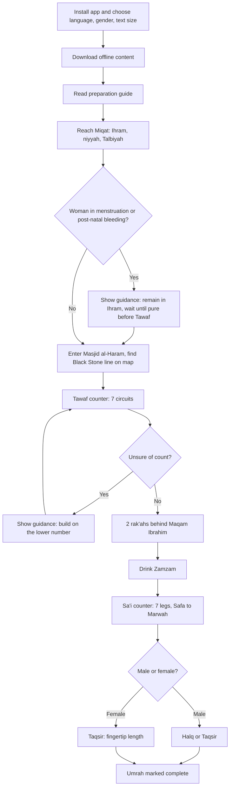

# Business Requirements Document: Umrah Pilgrim Guide Mobile Application

| Field            | Value                              |
|------------------|------------------------------------|
| Document ID      | BRD-UMR-001                        |
| Version          | 0.1 (Draft)                        |
| Date             | 2026-09-28                         |
| Author           | Business Analyst Agent             |
| Status           | Draft, pending stakeholder review  |
| Original request | "mobile application that with be used as informative to guide pelgrims on the umrah ritual" |

## 1. Executive Summary

Millions of Muslims perform Umrah each year. Many are first-time pilgrims, elderly, or do not speak Arabic. They often rely on printed booklets, group leaders, or memory to perform the rites in the correct order. Crowds in Makkah and weak mobile connectivity make it hard to look up guidance at the moment it is needed. Mistakes cause anxiety and can require corrective actions (for example, a penalty sacrifice).

The proposed solution is a free-to-use, informative mobile application that guides a pilgrim step by step through the Umrah ritual: from Ihram at the Miqat, through Tawaf, prayer at Maqam Ibrahim, Zamzam, and Sa'i, to Halq or Taqsir. It provides scholar-reviewed content, duas with Arabic text, transliteration, translation and audio, lap counters, progress tracking, and maps of Masjid al-Haram. It works fully offline, in many languages (including right-to-left scripts), and is designed for elderly and low-literacy users.

The app is educational only. It does not book travel, issue visas or permits, or take payments. It points users to official services such as the Nusuk platform for those needs. Expected value: more confident pilgrims, fewer ritual errors, less dependence on group leaders for basic questions, and a trusted, widely used guide.

## 2. Background and Problem Statement

**Current situation (as-is)**
- Pilgrims learn the rites from pre-travel seminars, printed booklets, videos, family, or their tour group leader (mutawwif).
- During the ritual, pilgrims count Tawaf and Sa'i laps mentally or with prayer beads, and read duas from paper.
- Official Saudi services (Nusuk) cover permits, visas and bookings. Guidance on performing the rites exists across many apps and websites of varying accuracy, language coverage and offline support.

**Pain points and business impact**
- Pilgrims lose count of laps in dense crowds, causing doubt and repeated circuits.
- Pilgrims forget the order of steps or the rules of Ihram, which can invalidate or require compensation for the rite.
- Non-Arabic speakers cannot read or pronounce duas correctly.
- Mobile data is slow or unavailable in and around Masjid al-Haram at peak times, so online-only resources fail.
- Elderly pilgrims struggle with small text and complex apps.
- Content of unknown origin undermines trust; users need to know that guidance is reviewed by qualified scholars.
- Men and women have different rules (Ihram clothing, hair cutting, menstruation), which generic guides often cover poorly.

**Why this matters now**
- Umrah volumes are growing under Saudi Vision 2030 targets for pilgrim numbers, and smartphone use among pilgrims is near-universal.
- Official platforms focus on permits and logistics, leaving room for a trusted, offline-first, multilingual ritual guide.

## 3. Business Objectives and Success Metrics

| ID    | Objective | KPI / Success Metric | Baseline | Target |
|-------|-----------|----------------------|----------|--------|
| BO-01 | Help pilgrims perform Umrah rites correctly and confidently | % of users who complete all Umrah steps in the in-app tracker; post-Umrah survey "I felt confident performing the rites" | TBD (no product yet) | 60% tracker completion among users who start; 85% agree or strongly agree |
| BO-02 | Provide trusted, accurate religious content | % of ritual content signed off by the scholarly review board before release; number of confirmed content errors reported per quarter | 0% (no content yet) | 100% signed off; fewer than 2 confirmed errors per quarter |
| BO-03 | Serve a global, multilingual audience | Number of supported languages at launch; % of active users using a non-English, non-Arabic language | TBD | 8 languages at launch (see A-04); TBD share |
| BO-04 | Work reliably inside Makkah regardless of connectivity | % of core guidance features usable with no network; crash-free session rate | TBD | 100% of core features offline; 99.5% crash-free sessions |
| BO-05 | Be usable by elderly and low-literacy pilgrims | Task success rate in usability tests with users aged 60+; WCAG conformance | TBD | 90% task success for "start Tawaf counter" and "play dua"; WCAG 2.2 AA |
| BO-06 | Achieve adoption and satisfaction | Downloads; monthly active users during peak season; app store rating | TBD | Downloads and MAU TBD (Q-01); rating 4.5 or higher |

## 4. Scope

### 4.1 In Scope
- Step-by-step guide for Umrah: preparation, Miqat and Ihram, intention (niyyah), Talbiyah, entering Masjid al-Haram, Tawaf, two rak'ahs behind Maqam Ibrahim, drinking Zamzam, Sa'i between Safa and Marwah, Halq or Taqsir, exiting Ihram.
- Gender-specific guidance (men and women), including Ihram clothing, prohibitions, hair cutting, and guidance for women in menstruation or post-natal bleeding.
- Rules of Ihram (prohibited acts) and general guidance on what to do after common mistakes, with the instruction to consult a scholar.
- Duas and dhikr per step, with Arabic text, transliteration, translation and audio recitation.
- Tawaf lap counter (7 circuits) and Sa'i lap counter (7 legs).
- Personal progress tracker for the current Umrah.
- Maps and diagrams of Masjid al-Haram (key points: Black Stone corner, Maqam Ibrahim, Safa, Marwah, green markers, main gates, Zamzam points, accessible routes).
- Miqat information (the five Miqat locations and guidance for air travellers).
- Pre-travel preparation content (checklist, packing, health reminders) as information only.
- Multilingual interface and content with right-to-left support.
- Full offline use after first download.
- Accessibility features for elderly and visually impaired users.
- Links to official services (for example Nusuk, Ministry of Hajj and Umrah) as external references.
- Content management and scholarly review workflow for the content team.
- Basic, privacy-preserving usage analytics with consent.

### 4.2 Out of Scope
- Booking of flights, hotels, transport or Umrah packages.
- Visa applications, Umrah permits, or Rawdah appointments (handled by Nusuk).
- Payments, donations, in-app purchases or sacrifice (hady/fidyah) purchasing.
- Hajj guidance (a separate rite with different steps).
- Issuing religious rulings (fatwas) or live chat with scholars.
- Real-time crowd density, live group tracking, or tracking other people's location.
- Turn-by-turn indoor navigation inside Masjid al-Haram.
- Social features (feeds, messaging, user-generated content).
- Integration with Nusuk or any government system (reference links only).
- Wearable (smartwatch) apps.

### 4.3 Future Considerations
- Guide for visiting Madinah and Masjid an-Nabawi (Ziyarah).
- Hajj guide module.
- Smartwatch lap counter and haptic feedback.
- Optional group-leader mode (share a checklist with a group).
- Additional languages (for example Persian, Bengali, Hausa, Swahili, Russian).
- Formal partnership or integration with official platforms, subject to approval.
- Sign-language video content for deaf pilgrims.

## 5. Stakeholders

| Stakeholder / Role | Interest or Responsibility | Involvement (RACI) |
|--------------------|----------------------------|--------------------|
| Product Owner / Sponsor | Owns vision, budget, priorities | A |
| Scholarly Review Board | Verifies accuracy of all religious content; approves content releases | A (content), R |
| Content and Translation Team | Writes, translates and records content and audio | R |
| Product / UX Design | Designs accessible, simple flows | R |
| Engineering (Mobile) | Builds and maintains the app | R |
| QA / Testing | Verifies requirements and accessibility | R |
| Legal and Privacy Officer | Compliance with PDPL, GDPR, app store rules | C |
| Pilgrims (end users) | Use the app to perform Umrah | C (research, testing) |
| Umrah Group Leaders / Travel Agents | Recommend the app to their groups; give feedback | C, I |
| Customer Support | Handles user feedback and content-error reports | R (support), I |
| Saudi authorities (Ministry of Hajj and Umrah) | Rules for pilgrims; official services referenced by the app | I |
| App Store platforms (Apple, Google) | Distribution and review policies | I |

## 6. User Roles and Personas

- **First-time pilgrim (e.g. "Aisha", 32, Jakarta, speaks Indonesian).** Goal: perform Umrah correctly and understand each step. Frustration: fears making a mistake; reads little Arabic; phone data unreliable abroad.
- **Elderly pilgrim (e.g. "Haji Rahman", 68, Lahore, speaks Urdu).** Goal: follow the rites with his family, recite duas. Frustration: small text, complex apps, loses count of laps, tires easily and needs accessible routes.
- **Experienced / repeat pilgrim (e.g. "Mehmet", 45, Istanbul, speaks Turkish).** Goal: quick reference for duas and a reliable lap counter. Frustration: apps full of ads and unneeded features.
- **Female pilgrim with specific needs (e.g. "Fatima", 27, Paris, speaks French).** Goal: clear guidance for women, including what to do if her period starts before Tawaf. Frustration: generic guides written only for men.
- **Group leader (e.g. "Ustadh Yusuf", Kuala Lumpur, speaks Malay).** Goal: point group members to a trusted reference in their language. Frustration: answering the same basic questions many times.
- **Content editor / scholar reviewer (internal).** Goal: publish accurate, reviewed content in many languages. Frustration: no clear review and version trail.

## 7. Business Process

### 7.1 Current Process (As-Is)
1. Pilgrim attends a seminar or reads a booklet before travel (optional).
2. Pilgrim enters Ihram at or before the Miqat, often guided by the group leader.
3. At Masjid al-Haram, pilgrim follows the group or crowd; counts Tawaf laps mentally.
4. Pilgrim reads duas from paper or recites what they remember.
5. Pilgrim performs Sa'i, again counting mentally.
6. Pilgrim cuts or shaves hair; asks others if unsure whether the Umrah is complete.
7. Doubts or mistakes are resolved by asking the group leader or a local scholar, if available.

### 7.2 Proposed Process (To-Be)
1. Pilgrim installs the app, selects language, gender (for guidance only) and text size.
2. App downloads all content and audio for the chosen language for offline use.
3. Before travel, pilgrim reads preparation content and the full step-by-step guide.
4. At the Miqat, pilgrim opens "Start my Umrah"; the app shows Ihram guidance, niyyah and Talbiyah with audio.
5. At Masjid al-Haram, pilgrim uses the map to find the Tawaf start line (Black Stone corner).
6. Pilgrim starts the Tawaf counter and taps once per completed circuit; duas for Tawaf are shown.
7. After 7 circuits, the app guides to prayer behind Maqam Ibrahim and to Zamzam.
8. Pilgrim goes to Safa and starts the Sa'i counter (Safa to Marwah = 1 leg; ends at Marwah after 7 legs).
9. App guides Halq (shaving) or Taqsir (trimming), with gender-specific rules.
10. App marks the Umrah complete and confirms release from Ihram restrictions.
11. At any point, pilgrim can open "I made a mistake / I am unsure" help content, which gives general guidance and advises consulting a scholar.

## 8. Functional Requirements

| ID    | Requirement (The system shall...) | Priority (MoSCoW) | Objective | Acceptance Criteria |
|-------|-----------------------------------|-------------------|-----------|---------------------|
| FR-01 | The system shall present the Umrah rites as an ordered list of steps: Preparation, Miqat and Ihram, Niyyah and Talbiyah, Entering Masjid al-Haram, Tawaf, Prayer at Maqam Ibrahim, Zamzam, Sa'i, Halq/Taqsir, Completion. | Must | BO-01 | Given a new user, when they open the guide, then all 10 steps are shown in this order and each opens a detail page. |
| FR-02 | The system shall show, for each step, a description of what to do, its religious status (for example pillar, obligatory, recommended), and common mistakes. | Must | BO-01, BO-02 | Every step page contains the three sections; QA checklist confirms 100% coverage. |
| FR-03 | The system shall let the user select a gender profile (male, female) to tailor guidance. | Must | BO-01 | Given gender = female, when viewing Ihram, then women's clothing rules are shown and men's-only rules are not. |
| FR-04 | The system shall show gender-specific Ihram guidance, including clothing and prohibitions for men and women. | Must | BO-01, BO-02 | Ihram page shows men's two-sheet garment rule for males and women's modest-dress rule (face and hands uncovered) for females. |
| FR-05 | The system shall provide guidance for women in menstruation or post-natal bleeding, including which acts may and may not be done. | Must | BO-01 | Given a female profile, when the user opens "Special situations", then the menstruation guidance page is available in all launch languages. |
| FR-06 | The system shall list the prohibitions of Ihram. | Must | BO-01 | A dedicated page lists all prohibitions approved by the review board. |
| FR-07 | The system shall provide Miqat information for the five Miqat locations, including guidance for pilgrims arriving by air. | Must | BO-01 | Miqat page lists Dhul Hulayfah, Al-Juhfah, Qarn al-Manazil, Yalamlam and Dhat Irq, with air-travel guidance. |
| FR-08 | The system shall display each dua or dhikr in Arabic script. | Must | BO-01, BO-03 | Every dua record shows fully vowelled Arabic text. |
| FR-09 | The system shall display a transliteration of each dua in Latin script. | Must | BO-03 | Every dua has a transliteration; none missing in content audit. |
| FR-10 | The system shall display a translation of each dua in the user's selected language. | Must | BO-03 | Given language = Urdu, when a dua is opened, then the Urdu translation is shown. |
| FR-11 | The system shall play an audio recitation of each dua, including the Talbiyah, with play, pause and repeat controls. | Must | BO-01, BO-05 | Every dua has audio; repeat mode loops until stopped. |
| FR-12 | The system shall provide a Tawaf counter that records 7 circuits via a large tap target, shows the current circuit number, and allows undo of the last tap. | Must | BO-01 | Given the counter at 3, when the user taps, then it shows 4; when they tap undo, then it shows 3. |
| FR-13 | The system shall notify the user with sound, vibration and a visual message when the 7th Tawaf circuit is recorded. | Must | BO-01, BO-05 | On 7th tap, all three signals fire (unless the user disabled sound). |
| FR-14 | The system shall provide a Sa'i counter that records 7 legs, showing the expected current position (Safa or Marwah). | Must | BO-01 | Leg 1 shows "Safa to Marwah"; leg 2 shows "Marwah to Safa"; after leg 7 it shows "Completed at Marwah". |
| FR-15 | The system shall keep the counter state if the app is closed, the phone locks, or the battery saver activates. | Must | BO-01, BO-04 | Given counter at 5, when the app is force-closed and reopened, then it shows 5. |
| FR-16 | The system shall show step-relevant duas and guidance on the counter screens. | Should | BO-01 | Tawaf counter screen shows the dua between the Yemeni Corner and the Black Stone. |
| FR-17 | The system shall show guidance when the user is unsure of their count. | Should | BO-01, BO-02 | An "Unsure?" button opens review-board-approved guidance. |
| FR-18 | The system shall track progress of the user's current Umrah, marking each step as not started, in progress or done. | Must | BO-01 | Completed steps show a check mark; progress persists after restart. |
| FR-19 | The system shall let the user reset progress to start a new Umrah, after confirmation. | Must | BO-01 | Reset requires a confirm dialog; after reset all steps show "not started". |
| FR-20 | The system shall display a map of Masjid al-Haram showing the Kaaba, Black Stone corner, Tawaf start line, Maqam Ibrahim, Safa, Marwah, green light markers, main gates, Zamzam points and accessible routes. | Must | BO-01, BO-04 | All listed points are labelled on the offline map in the user's language. |
| FR-21 | The system shall optionally show the user's approximate position on the map, only after the user grants location permission. | Could | BO-01 | Without permission the map works without a position marker; no location prompt appears until the user taps "Show my location". |
| FR-22 | The system shall provide diagrams or short videos showing Ihram dress, the direction of Tawaf (counter-clockwise, Kaaba on the left) and Idtiba/Raml for men. | Should | BO-01, BO-05 | Each listed topic has at least one visual asset. |
| FR-23 | The system shall support at launch the languages Arabic, English, Urdu, Indonesian, Malay, Turkish, French and Bengali for interface and content. | Must | BO-03 | Switching to each language translates 100% of interface strings and ritual content. |
| FR-24 | The system shall display right-to-left layouts for Arabic and Urdu. | Must | BO-03 | In Arabic and Urdu, layout, navigation and text direction mirror correctly; checked on all screens. |
| FR-25 | The system shall let the user change language at any time without losing progress. | Must | BO-03 | Given progress at Sa'i, when language changes, then progress and counters remain. |
| FR-26 | The system shall let the user download all content, audio and maps for their chosen language(s) for offline use, showing the download size first. | Must | BO-04 | Size is shown before download; after download, airplane-mode test passes for all core features. |
| FR-27 | The system shall work without a network connection for all core features (guide, duas, audio, counters, progress, map). | Must | BO-04 | Airplane-mode test of all core features passes on reference devices. |
| FR-28 | The system shall let the user adjust text size up to at least 200% without loss of content. | Must | BO-05 | At 200% text, no text is cut off on core screens. |
| FR-29 | The system shall offer a simple mode with large buttons and only the core steps, counters and duas. | Should | BO-05 | In simple mode, the home screen shows no more than 4 primary actions. |
| FR-30 | The system shall support screen readers (VoiceOver, TalkBack) on all core screens. | Must | BO-05 | Every control has an accessible label; screen reader test passes. |
| FR-31 | The system shall provide a pre-travel preparation checklist that the user can tick off. | Should | BO-01 | Checklist items can be ticked and persist offline. |
| FR-32 | The system shall provide a searchable FAQ of common questions and mistakes. | Should | BO-01 | Search for "hair" returns the Halq/Taqsir content in the selected language. |
| FR-33 | The system shall display on each ritual content page the name of the reviewing scholar or board and the date of last review. | Must | BO-02 | 100% of ritual pages show reviewer and review date. |
| FR-34 | The system shall state in the app that it is an educational guide, not a fatwa service, and that users should consult a qualified scholar in case of doubt. | Must | BO-02 | Disclaimer is shown on first launch and in "About". |
| FR-35 | The system shall indicate where recognised schools of thought (madhhab) differ on a point, and state the approach used. | Should | BO-02 | Pages flagged by the review board show a "Differences of opinion" note. |
| FR-36 | The system shall let the user report a suspected content error from any content page. | Must | BO-02 | Report form captures page ID, language and comment; stored and sent when online. |
| FR-37 | The system shall provide links to official services (Nusuk, Ministry of Hajj and Umrah) that open outside the app. | Should | BO-01 | Links open in the external browser or official app; no data is passed. |
| FR-38 | The system shall provide emergency information (Saudi emergency numbers, how to find help inside Masjid al-Haram, lost-person points) available offline. | Should | BO-01, BO-04 | Emergency page opens offline within 2 taps from home. |
| FR-39 | The system shall let authorised content editors create, edit and translate content in a content management tool. | Must | BO-02, BO-03 | Editor can create a draft in any launch language. |
| FR-40 | The system shall require approval by a Scholarly Review Board member before ritual content is published. | Must | BO-02 | Unapproved content cannot be published; attempt is blocked and logged. |
| FR-41 | The system shall keep a version history of all content with author, reviewer and date. | Must | BO-02 | Any published page can be traced to its approving reviewer and previous versions. |
| FR-42 | The system shall update offline content when the device is online, without losing user progress. | Must | BO-02, BO-04 | Given a new approved content version, when the device connects, then content updates and progress remains. |
| FR-43 | The system shall collect anonymous usage analytics only after user consent. | Should | BO-06 | With consent declined, no analytics events are sent (verified by network test). |
| FR-44 | The system shall collect optional in-app feedback and a post-Umrah satisfaction survey. | Could | BO-01, BO-06 | Survey appears once after Umrah is marked complete and can be dismissed. |
| FR-45 | The system shall be usable without creating an account. | Must | BO-06 | A new user can reach all core features without sign-up. |

### 8.1 User Stories

- **US-01**: As a first-time pilgrim, I want a step-by-step guide in my language, so that I perform each rite in the right order.
  - *Given* language = Indonesian, *When* I open "Start my Umrah", *Then* I see step 1 of 10 in Indonesian with a "Next" button.
- **US-02**: As an elderly pilgrim, I want a large lap counter with sound and vibration, so that I do not lose count in the crowd.
  - *Given* I am on circuit 6, *When* I tap the counter, *Then* it shows 7, vibrates, plays a tone and says "Tawaf complete".
- **US-03**: As a pilgrim who cannot read Arabic, I want to hear and read the duas in transliteration and translation, so that I can recite and understand them.
  - *Given* I open the Talbiyah, *When* I tap play, *Then* the audio plays and the transliteration and translation are shown.
- **US-04**: As a female pilgrim, I want guidance specific to women, so that I know what applies to me.
  - *Given* a female profile, *When* I open Halq/Taqsir, *Then* I see only the Taqsir guidance for women.
- **US-05**: As a pilgrim in Makkah with no signal, I want the whole guide to work offline, so that I can use it in the mosque.
  - *Given* content was downloaded and the phone is in airplane mode, *When* I open any core feature, *Then* it works fully.
- **US-06**: As a pilgrim, I want to find Safa and the Tawaf start line on a map, so that I start in the right place.
  - *Given* I open the map, *When* I tap "Tawaf start", *Then* the Black Stone corner line is highlighted.
- **US-07**: As a pilgrim, I want to know the content is reviewed by scholars, so that I can trust it.
  - *Given* any ritual page, *When* I scroll to the bottom, *Then* I see the reviewer and last review date.
- **US-08**: As a content editor, I want every change reviewed by a scholar before publishing, so that no unverified guidance reaches users.
  - *Given* a draft, *When* I try to publish without approval, *Then* publishing is blocked.
- **US-09**: As a pilgrim, I want my counter to survive my phone locking, so that I do not restart my Tawaf count.
  - *Given* counter = 4, *When* the phone locks and unlocks, *Then* the counter still shows 4.
- **US-10**: As a pilgrim, I want to report a mistake in the content, so that it can be corrected for others.
  - *Given* no network, *When* I submit a report, *Then* it is queued and sent once online.

## 9. Non-Functional Requirements

| ID     | Category | Requirement | Measure |
|--------|----------|-------------|---------|
| NFR-01 | Performance | App starts quickly on mid-range devices. | Cold start to home screen in 3 seconds or less on reference devices (see A-08). |
| NFR-02 | Performance | Counters respond instantly. | Tap to updated display in 100 ms or less; no missed taps in 1,000-tap test. |
| NFR-03 | Performance | Audio starts quickly offline. | Offline audio playback begins within 1 second of tap. |
| NFR-04 | Availability | Core features do not depend on any server. | 100% of core features pass airplane-mode test. |
| NFR-05 | Availability | Content update service is available during peak season. | 99.5% monthly uptime for content delivery. |
| NFR-06 | Reliability | App is stable. | 99.5% crash-free sessions; counter state lost in 0 of 100 kill/restart tests. |
| NFR-07 | Battery and storage | App is light on battery and storage. | Counter screen use for 60 minutes consumes 8% battery or less on reference devices; install size 100 MB or less; offline pack per language 250 MB or less (TBD, Q-07). |
| NFR-08 | Security | Content and data are protected. | All network traffic uses TLS 1.2 or higher; content packages are signed and verified before use; OWASP MASVS L1 verified. |
| NFR-09 | Security | Content management tool is access controlled. | Role-based access; multi-factor authentication for editors and reviewers. |
| NFR-10 | Privacy / Compliance | Minimal personal data. | No account required; gender, language and progress stored on device only; no personal data sent to servers except consented analytics and error reports. |
| NFR-11 | Privacy / Compliance | Location data is protected. | Location used only on the device, only while the map is open, only with permission; never stored or transmitted. |
| NFR-12 | Privacy / Compliance | Comply with applicable data laws. | Compliance with Saudi Personal Data Protection Law (PDPL), EU GDPR, and app store privacy disclosures; privacy policy available in all launch languages. |
| NFR-13 | Usability / Accessibility | Accessible to elderly and disabled users. | WCAG 2.2 Level AA for mobile content; minimum touch target 48 x 48 dp (counter button at least 30% of screen); contrast ratio at least 4.5:1. |
| NFR-14 | Usability | Easy for first-time users. | 90% of test users aged 60+ start the Tawaf counter unaided within 30 seconds. |
| NFR-15 | Usability | Usable in bright sunlight and one-handed. | Outdoor readability test passes; counters operable with one thumb. |
| NFR-16 | Localisation | Full localisation quality. | 100% of strings translated; each language reviewed by a native speaker; RTL verified for Arabic and Urdu. |
| NFR-17 | Scalability | Handle peak-season demand. | Content delivery supports TBD concurrent downloads (Q-01) during Ramadan peak without degradation. |
| NFR-18 | Compatibility | Runs on common devices. | iOS: last 3 major versions; Android 9 (API 28) and above (see A-07). |
| NFR-19 | Auditability | Content changes are traceable. | 100% of published content versions record author, reviewer, date and change note; logs kept 5 years. |
| NFR-20 | Supportability | Content errors are fixed fast. | Confirmed religious content errors corrected and published within 5 business days; critical errors within 48 hours. |
| NFR-21 | Supportability | Issues are diagnosable. | Anonymous crash reports (with consent) include app version, OS and device model. |
| NFR-22 | Content integrity | No ads or distracting content in the ritual flow. | 0 advertisements on ritual, dua and counter screens. |

## 10. Business Rules

| ID    | Rule | Source / Rationale |
|-------|------|--------------------|
| BR-01 | No ritual content may be published without approval from the Scholarly Review Board. | Trust and accuracy (BO-02). |
| BR-02 | The app provides general education only and must not present itself as issuing religious rulings. | Liability; scope. |
| BR-03 | Tawaf consists of 7 circuits, counter-clockwise, starting and ending at the Black Stone line. | Established Umrah practice; to be confirmed by review board. |
| BR-04 | Sa'i consists of 7 legs, starting at Safa and ending at Marwah; Safa to Marwah counts as one leg. | Established Umrah practice; to be confirmed by review board. |
| BR-05 | Guidance on when unsure of the count shall follow the approach approved by the review board (commonly: build on the lower, certain number). | Scholarly position; to be confirmed. |
| BR-06 | Men shave (Halq) or trim (Taqsir) the hair; women trim only, about a fingertip length. | Established practice; to be confirmed by review board. |
| BR-07 | Idtiba and Raml are shown as applying to men only, and Raml only in the first 3 circuits of Tawaf. | Established practice; to be confirmed. |
| BR-08 | Where schools of thought differ, the app shall state the difference or clearly name the approach followed. | Transparency (BO-02). |
| BR-09 | The app shall not collect or process data needed for permits, visas or payments. | Out of scope; privacy. |
| BR-10 | Official permit requirements shall be referenced by link to Nusuk / Ministry of Hajj and Umrah, not restated as authoritative. | Rules change; official sources govern. |
| BR-11 | Every language version of a ritual page must be reviewed for meaning before publishing. | Translation errors can change religious meaning. |
| BR-12 | Quranic text shall be taken from an authorised Mushaf source. | Accuracy of Quranic text. |
| BR-13 | Gender selection is optional; if not selected, the app shows guidance for both men and women. | Inclusivity; minimal data. |

## 11. Data Requirements

**Key business entities and attributes**
- **Ritual Step**: ID, order, title, description, religious status, gender applicability, common mistakes, related duas, media, reviewer, review date, version.
- **Dua / Dhikr**: ID, Arabic text, transliteration, translation per language, audio file, source reference (Quran / Hadith), related step.
- **Language Pack**: language code, text direction, version, size, publish date.
- **Map / Location Point**: ID, name per language, type (gate, Safa, Marwah, Maqam, Zamzam, accessible route), map coordinates on the diagram.
- **Miqat**: name, description, direction/region served, air-travel note.
- **FAQ Item**: question, answer, tags, related step, reviewer.
- **User Profile (on device only)**: language, gender (optional), text size, simple mode flag, consent choices.
- **Umrah Progress (on device only)**: step statuses, Tawaf count, Sa'i count, timestamps.
- **Content Error Report**: page ID, language, comment, app version, date (no personal identifiers unless the user adds contact details voluntarily).
- **Content Version / Audit Record**: content ID, version, author, reviewer, approval date, change note.

**Data sources**
- Religious content authored by the content team and approved by the Scholarly Review Board.
- Quranic text from an authorised Mushaf source; hadith references from recognised collections.
- Audio recorded by an approved reciter (see Q-05).
- Map diagrams produced or licensed by the business (see Q-06).

**Retention**
- On-device user data is kept until the user resets progress or deletes the app.
- Error reports kept 24 months, then deleted or anonymised.
- Analytics data kept in anonymised form for 24 months.
- Content audit records kept 5 years.

**Reporting needs**
- Downloads, active users and language mix by month and season.
- Tracker start and completion rates.
- Content error reports by page and language, with resolution time.
- Satisfaction survey results.
- Crash-free session rate by version.

## 12. Integrations and Dependencies

- **Apple App Store and Google Play**: distribution, review and privacy-label requirements.
- **Content management tool**: for authoring, translation, review and publishing (build or buy, see Q-09).
- **Content delivery service**: to deliver language packs and updates.
- **Analytics and crash reporting service**: consent-based, privacy-compliant.
- **Device services**: text-to-speech is not relied on; recorded audio is used. Optional device location for the map.
- **Nusuk / Ministry of Hajj and Umrah**: external links only; no data integration. Dependency on their public URLs remaining stable.
- **Scholarly Review Board**: availability for content review before each release.
- **Translators and native-speaker reviewers** for each launch language.
- **Reciter / audio studio** for dua recordings.
- **Map / diagram provider** for Masjid al-Haram layouts, which change with expansion works.

## 13. Assumptions

- A-01: The app is free to download. The business model (for example sponsorship, grant, or charitable funding) is TBD (Q-02); no ads appear in the ritual flow.
- A-02: The app covers Umrah only; Hajj and Madinah visits are future modules.
- A-03: Target platforms are iOS and Android smartphones; tablets are supported but not optimised.
- A-04: Launch languages are Arabic, English, Urdu, Indonesian, Malay, Turkish, French and Bengali, chosen for large Umrah pilgrim populations; final list to be confirmed (Q-03).
- A-05: The organisation will set up or contract a Scholarly Review Board.
- A-06: Default content follows mainstream Sunni scholarship with notes where the four main schools differ; to be confirmed (Q-04).
- A-07: Minimum OS support is Android 9 and the last three iOS major versions.
- A-08: Reference devices are a mid-range Android phone (about 4 GB RAM) and an iPhone released within the last 4 years.
- A-09: No user accounts are needed at launch; all personal settings stay on the device.
- A-10: The map is a static, stylised diagram rather than live indoor navigation, because GPS is unreliable inside the mosque.
- A-11: Lap counting is manual (user taps). Automatic counting from location is not attempted due to accuracy and privacy concerns.
- A-12: Users download content before travel or on hotel Wi-Fi.
- A-13: No formal agreement with Saudi authorities is required for an informational app that only links to official services; to be confirmed by legal (Q-08).
- A-14: Baselines for all KPIs are TBD because no product exists yet; baselines will be set in the first peak season.

## 14. Constraints

- **Regulatory**: Saudi PDPL, EU GDPR and other applicable privacy laws; app store policies on religious content and data collection; Saudi rules on media and publications if distributed in Saudi Arabia (to be confirmed by legal).
- **Religious**: Content must be accurate and approved; changes cannot be released without review, which limits release speed.
- **Technology**: Must work offline and on mid-range devices with limited storage and battery.
- **Environment**: Very dense crowds, heat and bright sunlight in Makkah; users often operate the phone with one hand while walking.
- **Physical site changes**: Masjid al-Haram is under ongoing expansion; gate names, routes and Sa'i levels can change.
- **Budget and timeline**: TBD (Q-02, Q-10).
- **Organisational**: Availability of qualified scholars and native-speaker translators.

## 15. Risks and Mitigations

| ID   | Risk | Likelihood (H/M/L) | Impact (H/M/L) | Mitigation |
|------|------|--------------------|----------------|------------|
| R-01 | Religious content error leads a pilgrim to an invalid or deficient rite. | M | H | Mandatory scholarly approval (BR-01); visible reviewer info; error reporting and 48-hour fix for critical errors; disclaimer (FR-34). |
| R-02 | Translation changes the meaning of religious guidance. | M | H | Native-speaker and scholar review per language (BR-11). |
| R-03 | Disagreement between schools of thought causes user distrust. | M | M | State differences transparently (FR-35); publish the methodology. |
| R-04 | Offline content is outdated after site changes (gates, routes). | M | M | Automatic updates when online; version date shown on map. |
| R-05 | Users lose counter state in the middle of Tawaf. | L | H | Persist state on every tap (FR-15); kill/restart tests (NFR-06). |
| R-06 | Privacy breach or misuse of location data. | L | H | No accounts; on-device data; location never stored (NFR-10, NFR-11). |
| R-07 | Low adoption because of many competing apps and official Nusuk services. | M | M | Differentiate on accuracy, offline use, accessibility; partnerships with group leaders and travel agents. |
| R-08 | Elderly users find the app too complex. | M | H | Simple mode (FR-29); usability testing with users aged 60+ (NFR-14). |
| R-09 | Large offline packs deter downloads. | M | M | Per-language packs; show size before download; optional video. |
| R-10 | Unclear regulatory position for distributing religious guidance in Saudi Arabia. | L | M | Legal review before launch (Q-08). |
| R-11 | Scholarly Review Board capacity delays releases. | M | M | Agree review SLAs; plan content early; batch reviews. |

## 16. Open Questions

| ID   | Question | Owner | Suggested Default |
|------|----------|-------|-------------------|
| Q-01 | What are the targets for downloads, monthly active users and peak concurrent downloads? | Product Owner | Set after market sizing; plan infrastructure for 100,000 downloads in the first peak season. |
| Q-02 | What is the funding / business model and budget? | Sponsor | Free app with no ads, funded by sponsor or charitable grant. |
| Q-03 | Which languages are required at launch? | Product Owner | The 8 languages in A-04; add Persian and Hausa in phase 2. |
| Q-04 | Which scholarly methodology (madhhab approach) should the content follow? | Scholarly Review Board | Mainstream Sunni content with differences of the four schools noted. |
| Q-05 | Who will record the dua audio and who holds the rights? | Content Lead | Commission an approved reciter under a full-rights agreement. |
| Q-06 | Will map diagrams be produced in-house or licensed, and who approves accuracy? | Product Owner | Produce in-house from public official layouts, reviewed each season. |
| Q-07 | What maximum download size is acceptable per language pack? | Product / UX | 250 MB with video optional. |
| Q-08 | Are any Saudi approvals or licences needed to publish a religious guidance app, and does linking to Nusuk need permission? | Legal | No licence needed for links; confirm with local counsel before launch. |
| Q-09 | Should the content management tool be built or bought? | Engineering Lead | Use an existing headless CMS with a review workflow. |
| Q-10 | What is the target launch date (for example before Ramadan 2027)? | Sponsor | Launch at least 6 weeks before Ramadan 2027 to allow a stabilisation period. |
| Q-11 | Should the app include the Madinah visit (Ziyarah) at launch? | Product Owner | No, phase 2. |
| Q-12 | Should gender be asked at onboarding or only when relevant? | UX / Review Board | Optional at onboarding; show both if skipped (BR-13). |
| Q-13 | What organisation name and branding will be shown as publisher and content authority? | Sponsor | TBD. |

## 17. Requirements Traceability Matrix

| Business Objective | Functional Requirements | User Stories | NFRs |
|--------------------|-------------------------|--------------|------|
| BO-01 Correct, confident rites | FR-01 to FR-22, FR-31, FR-32, FR-37, FR-38, FR-44 | US-01, US-02, US-03, US-04, US-06, US-09 | NFR-02, NFR-03, NFR-06, NFR-14, NFR-15, NFR-22 |
| BO-02 Trusted, accurate content | FR-02, FR-04, FR-17, FR-33, FR-34, FR-35, FR-36, FR-39, FR-40, FR-41, FR-42 | US-07, US-08, US-10 | NFR-08, NFR-09, NFR-19, NFR-20 |
| BO-03 Multilingual audience | FR-08, FR-09, FR-10, FR-23, FR-24, FR-25, FR-39 | US-01, US-03 | NFR-16 |
| BO-04 Reliable offline use | FR-15, FR-20, FR-26, FR-27, FR-38, FR-42 | US-05, US-09 | NFR-01, NFR-04, NFR-05, NFR-06, NFR-07 |
| BO-05 Usable by elderly / low-literacy | FR-11, FR-13, FR-22, FR-28, FR-29, FR-30 | US-02, US-03 | NFR-13, NFR-14, NFR-15 |
| BO-06 Adoption and satisfaction | FR-43, FR-44, FR-45 | US-01, US-05 | NFR-10, NFR-11, NFR-12, NFR-17, NFR-18, NFR-21 |

## 18. Glossary

| Term | Definition |
|------|------------|
| Umrah | The "lesser pilgrimage" to Makkah, which can be performed at any time of year. |
| Hajj | The major annual pilgrimage in Dhul Hijjah; out of scope. |
| Ihram | The sacred state a pilgrim enters for Umrah, and the clothing worn by men in that state. |
| Miqat | Designated boundary points where pilgrims must enter Ihram before approaching Makkah. |
| Niyyah | The intention to perform Umrah. |
| Talbiyah | The phrase "Labbayk Allahumma labbayk..." recited after entering Ihram. |
| Masjid al-Haram | The Grand Mosque in Makkah that surrounds the Kaaba. |
| Kaaba | The cube-shaped building at the centre of Masjid al-Haram. |
| Black Stone (al-Hajar al-Aswad) | The stone set in a corner of the Kaaba where each Tawaf circuit starts and ends. |
| Tawaf | Walking seven times around the Kaaba counter-clockwise. |
| Idtiba | Men wearing the upper Ihram sheet under the right arm, leaving the right shoulder bare, during Tawaf. |
| Raml | Men walking briskly with short steps in the first three circuits of Tawaf. |
| Maqam Ibrahim | The Station of Abraham, near the Kaaba, behind which two rak'ahs are prayed after Tawaf. |
| Rak'ah | A unit of Islamic prayer. |
| Zamzam | The sacred well water in Masjid al-Haram. |
| Sa'i | Walking seven times between the hills of Safa and Marwah. |
| Safa and Marwah | Two small hills, now inside Masjid al-Haram, between which Sa'i is performed. |
| Halq | Shaving the head (men) to exit Ihram. |
| Taqsir | Trimming the hair to exit Ihram (men may choose it; women trim only). |
| Dua | A personal supplication to God. |
| Dhikr | Remembrance of God through set phrases. |
| Transliteration | Arabic words written in Latin letters to help pronunciation. |
| Madhhab | A school of Islamic jurisprudence (for example Hanafi, Maliki, Shafi'i, Hanbali). |
| Fatwa | A formal religious ruling by a qualified scholar. |
| Mutawwif | A guide who leads pilgrims through the rites. |
| Nusuk | The official Saudi platform for Umrah permits, visas and pilgrimage services. |
| RTL | Right-to-left text direction, used for Arabic and Urdu. |
| PDPL | Saudi Arabia's Personal Data Protection Law. |
| GDPR | EU General Data Protection Regulation. |
| WCAG | Web Content Accessibility Guidelines; used here as the accessibility standard. |
| OWASP MASVS | OWASP Mobile Application Security Verification Standard. |
| MoSCoW | Prioritisation method: Must, Should, Could, Won't. |
| RACI | Responsible, Accountable, Consulted, Informed. |

## 19. Approval

| Name | Role | Decision | Date |
|------|------|----------|------|
| TBD | Product Owner / Sponsor | Pending | |
| TBD | Chair, Scholarly Review Board | Pending | |
| TBD | Engineering Lead | Pending | |
| TBD | Legal and Privacy Officer | Pending | |
| TBD | UX Lead | Pending | |
